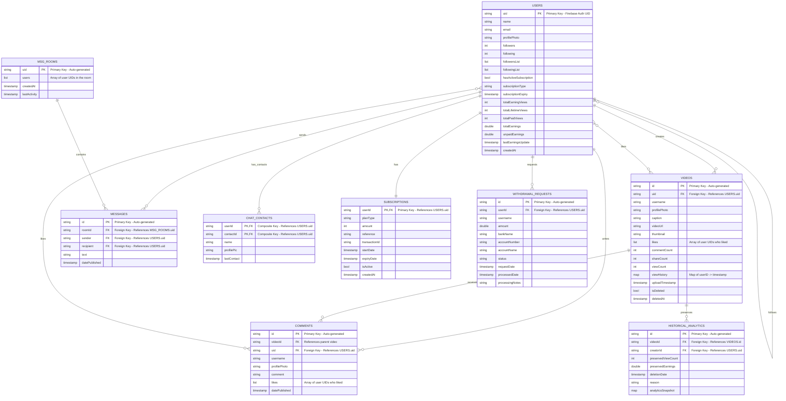

# PlaySphere - Entity Relationship Diagram (ERD)

## Database Schema Overview

This document presents the Entity Relationship Diagram for the PlaySphere social video platform, built on Firebase Firestore.

---

## ERD Diagram



---

## Entity Descriptions

### 1. USERS
**Primary entity representing platform users**
- **Purpose**: Store user profiles, authentication data, earnings, and social connections
- **Key Features**: 
  - Firebase Auth integration via `uid`
  - Creator monetization tracking
  - Social following system
  - Subscription status management

### 2. VIDEOS
**Core content entity for video uploads**
- **Purpose**: Store video metadata, engagement metrics, and view analytics
- **Key Features**:
  - Advanced view tracking with user history
  - Engagement metrics (likes, comments, shares)
  - Soft deletion support
  - Upload timestamp for chronological ordering

### 3. COMMENTS
**User-generated content on videos**
- **Purpose**: Enable user interaction through commenting system
- **Key Features**:
  - Nested commenting capability
  - Like system for comments
  - User attribution with profile data

### 4. MESSAGES
**Direct messaging between users**
- **Purpose**: Enable private communication between platform users
- **Key Features**:
  - Room-based messaging system
  - Real-time message delivery
  - User-to-user communication tracking

### 5. MSG_ROOMS
**Chat rooms for organizing conversations**
- **Purpose**: Group messages between users in organized rooms
- **Key Features**:
  - Multi-user room support
  - Activity tracking
  - Relationship management

### 6. CHAT_CONTACTS
**User contact management**
- **Purpose**: Maintain user contact lists for messaging
- **Key Features**:
  - Bidirectional contact relationships
  - Profile data caching for performance
  - Last contact tracking

### 7. SUBSCRIPTIONS
**Premium subscription management**
- **Purpose**: Handle paid subscriptions and free trials
- **Key Features**:
  - Multiple subscription tiers
  - Payment tracking integration
  - Expiry date management
  - Trial eligibility tracking

### 8. HISTORICAL_ANALYTICS
**Analytics data preservation**
- **Purpose**: Preserve creator earnings and analytics data even after content deletion
- **Key Features**:
  - Data preservation for deleted content
  - Earnings protection for creators
  - Analytics snapshot storage

### 9. WITHDRAWAL_REQUESTS
**Creator payout management**
- **Purpose**: Handle creator withdrawal requests and payment processing
- **Key Features**:
  - Bank account information storage
  - Request status tracking
  - Payment processing workflow

---

## Key Relationships

### 1. User-Centric Relationships
- **One-to-Many**: User creates multiple Videos
- **One-to-Many**: User writes multiple Comments
- **One-to-One**: User has one Subscription
- **Many-to-Many**: Users follow other Users (implicit through followersList/followingList)

### 2. Content Relationships
- **One-to-Many**: Video receives multiple Comments
- **Many-to-Many**: Videos liked by multiple Users (through likes array)
- **One-to-Many**: Video preserved in multiple Historical_Analytics records

### 3. Messaging Relationships
- **Many-to-Many**: Users participate in multiple MSG_ROOMS
- **One-to-Many**: MSG_ROOM contains multiple Messages
- **Many-to-Many**: Users have multiple Chat_Contacts

### 4. Monetization Relationships
- **One-to-Many**: User creates multiple Withdrawal_Requests
- **One-to-Many**: User's videos generate Historical_Analytics records

---

## Data Flow Patterns

### 1. **Video Upload Flow**
```
User → Video Creation → View Tracking → Earnings Calculation → Analytics Storage
```

### 2. **Social Interaction Flow**
```
User A → Follows User B → Video Discovery → Like/Comment → Engagement Analytics
```

### 3. **Messaging Flow**
```
User A → Chat_Contact → MSG_ROOM Creation → Message Exchange → Real-time Updates
```

### 4. **Monetization Flow**
```
Video Views → Earnings Calculation → User Balance Update → Withdrawal Request → Payment Processing
```

---

## Firebase Firestore Collections

1. **`users`** - User profiles and earnings data
2. **`videos`** - Video content and metadata
3. **`comments`** - Video comments (subcollection under videos)
4. **`messages`** - Direct messages
5. **`msgRooms`** - Chat room management
6. **`chatContacts`** - User contact lists
7. **`subscriptions`** - Premium subscription data
8. **`historicalAnalytics`** - Preserved analytics data
9. **`withdrawalRequests`** - Creator payout requests

---

## Security Rules Considerations

- **User Data**: Access restricted to authenticated users and document owners
- **Videos**: Public read access, owner-only write access
- **Messages**: Access restricted to room participants only
- **Earnings Data**: Highly restricted access for financial security
- **Analytics**: Read-only for creators, admin write access

---

*This ERD represents the current database schema for PlaySphere v1.0*
